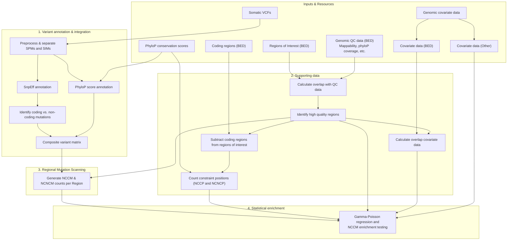

# NCCM-analysis pipeline

## Overview

The **NCCM (Non-Coding Constraint Mutation) analysis pipeline** is a Snakemake workflow designed to identify genes and regulatory genomic regions significantly enriched for somatic mutations in evolutionary constrained non-coding positions.

In cancer genomics, the vast majority of somatic variants fall within non-coding regions, making it challenging to differentiate driver events from neutral passenger mutations. This pipeline addresses this challenge by combining functional variant annotation, cross-species evolutionary conservation (phyloP), and genomic covariates to detect non-coding driver candidates.



## Workflow

1. **Variant annotation & integration**:
   - Preprocesses somatic point mutations (SPMs) and somatic indels (SIMs) from single or separate sample VCFs.
   - Annotates functional impact (coding vs. non-coding) using [snpEff](https://pcingola.github.io/SnpEff/).
   - Maps base-pair evolutionary conservation using **phyloP** scores.
   - Integrates sample VAFs, annotations, and conservation scores into an aggregated **composite matrix** (`results/composite_matrix/*composite_matrix.tsv.gz`).

2. **Regional mutation scanning**:
   - Intersects non-coding variants with user-defined regions of interest specified in a `gene_set` BED file (e.g. gene flanking regions or sliding windows).
   - Generates counts per region for non-coding constrained mutations (NCCMs), non-constrained mutations (NCNCMs), and unique affected samples (`results/nccms/`).

3. **Supporting baseline data generation**:
   - **Constraint position counting (`phylop_counts`)**: Determines the exact number of non-coding constraint positions (NCCPs) and non-constraint positions (NCNCPs) per region after excluding coding protein-coding regions.
   - **Quality Control & Covariates (`gene_qc`)**: Calculates region-level overlap with genomic QC data (e.g. low-mappability regions) and genomic covariates (e.g. ATAC-seq open chromatin peaks).

4. **Downstream Statistical Testing (`nccm_enrichment`)**:
   - Fits a **Gamma-Poisson (Negative Binomial) regression** using $\log(\text{NCCP})$ as an offset, controlling for background mutation rates (derived from NCNCMs) and genomic covariates (GC content, replication timing, chromatin accessibility, expression).
   - Can use **Empirical Brown's Method** to combine p-values across multiple window/flank sizes (e.g. 5, 10, 50, and 100 kbp) while accounting for statistical dependency.
   - Adjusts for multiple testing across all candidate regions using False Discovery Rate (FDR).

### Key Concepts

| Term | Full Name | Description |
| :--- | :--- | :--- |
| **NCCM** | Non-Coding Constraint Mutation | Somatic variant in a non-coding region occurring at an evolutionary constrained position ($\text{phyloP} \ge \text{threshold}$). |
| **NCNCM** | Non-Coding Non-Constraint Mutation | Somatic variant in a non-coding region occurring at a non-constrained position ($\text{phyloP} < \text{threshold}$). Used to model local background mutation rate. |
| **NCCP** | Non-Coding Constraint Position | Number of non-coding, evolutionary constrained base pairs within a target region (used as the regression offset). |
| **NCNCP** | Non-Coding Non-Constraint Position | Number of non-coding, non-constrained base pairs within a target region. |
| **Regions of Interest** | Gene Flanks / Sliding Windows | BED-formatted target intervals (e.g., promoters, gene-centric flanks, or sliding genomic windows) tested for NCCM burden. |

## Input 

The input data to the pipeline are either vcf files or a data matrix from a previous run. Specify which to use as a starting point with the `start_from` option in the config file (see below in section `Config`). 

To start from vcf files, provide filtered somatic variants in gzip compressed vcf file. For each sample, either provide one vcf that includes both somatic point mutations (SPIMs) and somatic indel mutations (SIMs), or two vcfs that are somatic point (SPM) and indel mutation (SIM) separated (one SPM file and one SIM file as e.g. from Mutect2 output). List the input files in an tsv file with with header that is either `sample spim` or `sample spm sim` - see `config/example.input.tsv`. Provide absolute file paths.

To start from a pre-existing matrix, you can provide an absolute path to that matrix in the config file. The matrix must match the format created by this pipeline.

## Required resources

When starting from vcf input:

- PhyloP scores separated by chromosome in gzipped bed files. Columns (no header): `chromosome start end id phyloP`. The files have to be named as follows: chr1.bed.gz, chr2.bed.gz, chr3.bed.gz

Always:

- A list of chromosomes for your genome, e.g. `resources/canfam4.chromosomes.txt`

To create supporting data for the NCCM analysis:

- To count the number of non-coding constraint positions per region, provide a bed file of all protein-coding regions in the genome with the following columns (noheader): `chromosome start end`

For the NCCM analysis:

- A set of genes to test for NCCM enrichment in bed format, with the following columns (no header): `chromosome lower_flank upper_flank gene`. See `resources/canfam4_gene_100kb_flanks_4_NCCM_v2.bed`

Make sure the chromosome notation is consistent across all input and resource data (e.g. either `chr1` or `1`)! Including vcf files, the phyloP scores bed file content + the naming of the phylP score bed files, the chromosome list file and the gene flanks file.

## Config

In the config file `config/config.yaml`, change `vcfs: "config/example.input.tsv"` to the name of your input tsv file. Also, set `spim:` to either  `"separated"` or `"combined"`, depending on whether you provided one or two vcf files.

- `start_from`: `"vcf"` or `"matrix"`

    - depending on `start_from` either of the following two must be set:

        - `vcfs`: path to the input tsv file described above

        - `matrix`: path to a pre-existing matrix

- `genome`: Genome input for [snpEff](https://pcingola.github.io/SnpEff/snpeff/introduction/) - e.g. GRCh37.75

- `phyloP`: Path for the directory of phyloP score files

- `phyloP_threshold`: The threshold for what is considered constraint - we have used 1.2 for human and 1.3 for dogs (8% of the genome)

- `phyloP_format`: whether scores are formatted as `bed` or bigwig `bw` format. Usually `bed`.

- `chrom_list`: Path for file with list of chromosomes, see above in *Required resources*

- `gene_set`: Path of the gene_set file as described in *Required resources*

- `coding_bed`: Path to bed file of coding regions in the genome as described in *Required resources*

- `qc_bed`: Path to bed files with poor quality regions

- `threads`: Number of threads available for the run. 

## Software

Tested with the followinng software versions. 

- Snakemake (version 7.8.5)
- BEDOPS (version 2.4.39)
- snpEff (version 4.3t)
- python3 (version 3.9.5)
- BEDTools (version 2.29.2)

On Uppmax do `module load bioinfo-tools snakemake/7.8.5 BEDOPS/2.4.39 snpEff/4.3t python3/3.9.5 BEDTools/2.29.2`

## Run

### Quick start

Test/dry run:

`snakemake -np all`

Run the whole workflow with e.g. 16 cores:

`snakemake --cores 16 all`

Create the matrix, don't run the nccm analysis:

`snakemake --cores 16 composite_matrix`

Run only nccm analysis with a pre-existing matrix:

`snakemake --cores 16 nccms`

### Data preparation

For every flank file, we need to count the number of non-coding constraint and non-coding non-constraint positions. If you provide a bed file with coding regions (see `Config`), we can do so like this:

```snakemake --cores 16 phylop_counts --config gene_set=/proj/sens2017503/nobackup/13_NCCM_pipeline_hg38/1_preprocessing/1_create_new_gene_flanks/hg38_gene_100kb_flanks.tsv```

Some flanks or regions will be of poor quality, e.g. poor mappability. To understand the overlap of the regions with known quality metrics, intersect the flank files with a bed file with QC data of your own choosing, e.g. regions of poor mappability. For this we can calculate the overlap with any qc data in bed format:

```snakemake --cores 16 gene_qc --config qc_bed=/proj/sens2017503/nobackup/12_pancancer_RP/1_new_flanks_file/e_gene_filtering/2_mappability/k100.umap.lt1.sorted.merged.bed.gz```

## Output

Main output files:

- `results/composite_matrix/*.composite_matrix.tsv.gz` - includes all annotation data (snpeff + phyloP) for all samples. Missing phylop cores are `NaN`. 

- `results/nccms/*scan.tsv` - this is the main output.

## Acknowledgements

This project uses code adapted from **CombiningDependentPvaluesUsingEBM** by William Poole.
* **Source:** [Link to the GitHub Repository](https://github.com/IlyaLab/CombiningDependentPvaluesUsingEBM)
* **License:** Apache 2.0
* **File:** The file `src/nccm_enrichment/vendor/EmpiricalBrownsMethod.py` is from [here](https://github.com/IlyaLab/CombiningDependentPvaluesUsingEBM/blob/master/Python/EmpiricalBrownsMethod.py).
