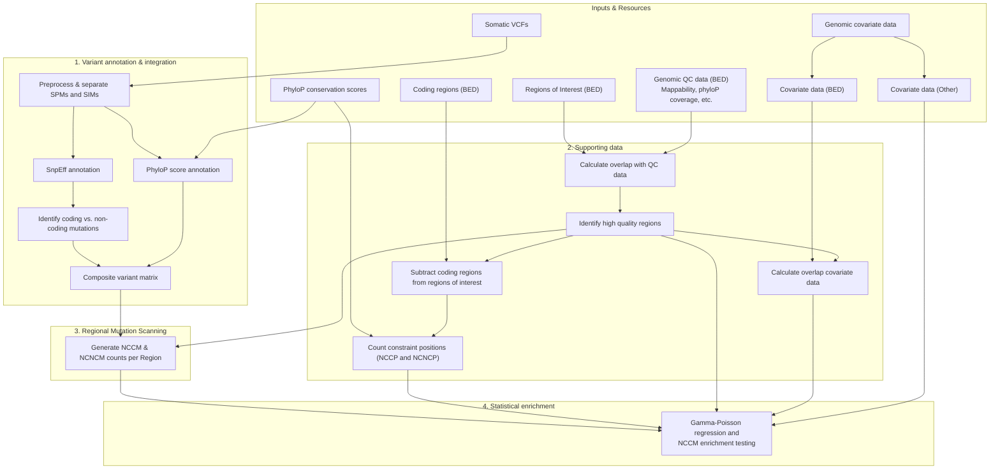

# NCCM-analysis pipeline

## Overview

The **NCCM (Non-Coding Constraint Mutation) analysis pipeline** is a Snakemake workflow designed to identify genes and regulatory genomic regions significantly enriched for somatic mutations in evolutionary constrained non-coding positions.

In cancer genomics, the vast majority of somatic variants fall within non-coding regions, where it is challenging to differentiate driver events from neutral passenger mutations. This pipeline addresses this challenge by combining functional variant annotation, cross-species evolutionary conservation (phyloP), and genomic covariates to detect non-coding driver candidates.



## Table of Contents

- [Overview](#overview)
- [Workflow](#workflow)
- [Key Concepts](#key-concepts)
- [Repository Structure](#repository-structure)
- [Installation & Software](#installation--software)
- [Input Data](#input)
- [Required Resources](#required-resources)
- [Configuration](#config)
- [Running the Pipeline](#run)
  - [Quick Start](#quick-start)
  - [Data Preparation (Supporting Data)](#data-preparation)
  - [Downstream Statistical Enrichment](#downstream-statistical-enrichment)
- [Output Files](#output)
  - [Primary Outputs](#primary-outputs)
  - [Supporting Data Outputs](#supporting-data-outputs)
- [Acknowledgements](#acknowledgements)

---

## Workflow

1. **Variant annotation & integration**:
   - Preprocesses somatic point mutations (SPMs) and somatic indels (SIMs) from single or separate sample VCFs.
   - Annotates functional impact (coding vs. non-coding) using [snpEff](https://pcingola.github.io/SnpEff/).
   - Maps base-pair evolutionary conservation using **phyloP** scores.
   - Integrates sample VAFs, annotations, and conservation scores into an aggregated **composite matrix** (`results/composite_matrix/*composite_matrix.tsv.gz`).

2. **Regional mutation scanning**:
   - Intersects non-coding variants with user-defined regions of interest specified in a `gene_set` BED file (e.g. gene flanking regions or sliding windows).
   - Generates counts per region for non-coding constrained mutations (NCCMs), non-constrained mutations (NCNCMs), and unique affected samples (`results/nccms/`).

3. **Supporting baseline data generation**:
   - **Constraint position counting (`phylop_counts`)**: Determines the exact number of non-coding constraint positions (NCCPs) and non-constraint positions (NCNCPs) per region after excluding protein-coding regions.
   - **Quality Control & Covariates (`gene_qc`)**: Calculates region-level overlap with genomic QC data (e.g. low-mappability regions) and genomic covariates (e.g. ATAC-seq open chromatin peaks).

4. **Downstream Statistical Testing (`nccm_enrichment`)**:
   - Fits a **Gamma-Poisson (Negative Binomial) regression** using $\log(\text{NCCP})$ as an offset, controlling for background mutation rates (derived from NCNCMs) and genomic covariates (GC content, replication timing, chromatin accessibility, expression).
   - Can use **Empirical Brown's Method** to combine p-values across multiple window/flank sizes (e.g. 5, 10, 50, and 100 kbp) while accounting for statistical dependency.
   - Adjusts for multiple testing across all candidate regions using False Discovery Rate (FDR).

### Key Concepts

| Term | Full Name | Description |
| :--- | :--- | :--- |
| **NCCM** | Non-Coding Constraint Mutation | Somatic variant in a non-coding region occurring at an evolutionary constrained position ($\text{phyloP} \ge \text{threshold}$). |
| **NCNCM** | Non-Coding Non-Constraint Mutation | Somatic variant in a non-coding region occurring at a non-constrained position ($\text{phyloP} < \text{threshold}$). Used to model local background mutation rate. |
| **NCCP** | Non-Coding Constraint Position | Number of non-coding, evolutionary constrained base pairs within a target region (used as the regression offset). |
| **NCNCP** | Non-Coding Non-Constraint Position | Number of non-coding, non-constrained base pairs within a target region (used to calculate the background mutation rate). |
| **Regions of Interest** | Gene Flanks / Sliding Windows | BED-formatted target intervals (e.g., promoters, gene-centric flanks, or sliding genomic windows) tested for NCCM burden. |

---

## Repository Structure

```text
├── config/
│   ├── config.yaml          # Main pipeline configuration file
│   └── example.input.tsv    # Example sample sheet format
├── resources/               # Reference annotations (chromosomes list, gene sets, BEDs)
├── workflow/
│   ├── rules/               # Modular Snakemake rule definitions (.smk)
│   ├── scripts/             # Python & Bash processing scripts
│   └── Snakefile            # Snakemake workflow entry point
├── src/nccm_enrichment/     # Python package for Negative Binomial regression & EBM
├── notebooks/               # Jupyter notebooks for downstream statistical analysis
├── submit.*.sh              # SLURM submission helper scripts
├── results/                 # Default output directory (generated at runtime)
└── pyproject.toml           # Python package configuration & dependencies
```

---

## Installation & Software

The pipeline requires Snakemake, standard bioinformatics CLI utilities (BEDTools, BEDOPS, snpEff), and the internal Python statistical library `nccm_enrichment`.

### Option A: Conda / Mamba (Recommended for Local / Generic HPC)

Create and activate a conda environment containing the required dependencies:

```
conda create -n nccm -c bioconda -c conda-forge \
    snakemake=7.8.5 bedtools=2.29.2 bedops=2.4.39 snpeff=4.3t python=3.9

conda activate nccm

# Install the nccm_enrichment statistical package in editable mode
pip install -e .
```

### Option B: UPPMAX (HPC Module Loading)

On UPPMAX clusters, load the pre-installed modules and install the Python package:

```
module load bioinfo-tools snakemake/7.8.5 BEDOPS/2.4.39 snpEff/4.3t python3/3.9.5 BEDTools/2.29.2

# Install the nccm_enrichment package
pip install -e .
```

---

## Input 

The input data to the pipeline are either VCF files or a pre-existing composite matrix from a previous run. Specify which starting mode to use via the `start_from` option in `config/config.yaml`:

1. **Starting from VCF files (`start_from: "vcf"`)**:
   Provide filtered somatic variants in gzip-compressed VCF format. For each sample, you can supply either:
   - **Combined**: One VCF containing both somatic point mutations (SPMs) and indels (SIMs).
   - **Separated**: Two VCFs per sample, one for point mutations (SPM) and one for indels (SIM) (e.g., separate Mutect2 outputs).

   List your input files in a tab-separated file (TSV) containing absolute paths. The header must be either `sample spim` (combined) or `sample spm sim` (separated). See `config/example.input.tsv`.

2. **Starting from a pre-existing matrix (`start_from: "matrix"`)**:
   Provide the absolute path to a composite matrix via `matrix_path` in `config/config.yaml`. The matrix must match the schema generated by this pipeline (`*.composite_matrix.tsv.gz`).

---

## Required Resources

When starting from VCF input:
- **PhyloP scores**: Gzipped BED files separated by chromosome with columns (no header): `chromosome start end id phyloP`. Files must be named according to chromosome: `chr1.bed.gz`, `chr2.bed.gz`, etc. (or `1.bed.gz`, etc. depending on your chromosome naming scheme).

Always required:
- **Chromosome list**: Text file listing chromosomes in the target genome, one per line (e.g. `resources/canfam4.chromosomes.txt` or `resources/hg19.chromosomes.txt`).
- **Protein-coding regions**: A 3-column BED file (no header: `chromosome start end`) containing all protein-coding exons in the genome, used to mask coding regions and compute non-coding baseline statistics.
- **Regions of interest (Gene set)**: A 4-column BED file (no header: `chromosome lower_flank upper_flank gene`) defining candidate intervals to scan (e.g., `resources/canfam4_gene_100kb_flanks_4_NCCM_v2.bed`).
- **Genomic QC / Covariates**: BED file(s) containing regions of poor quality (e.g., UMAP mappability < 1) or genomic covariates (e.g., ATAC-seq peak intervals).

> [!IMPORTANT]
> **Chromosome naming consistency:** Ensure chromosome identifiers (e.g. `chr1` vs `1`) are consistent across all inputs and resources, including VCFs, phyloP filenames/contents, chromosome lists, and BED files.

---

## Config

Configure pipeline parameters in `config/config.yaml`:

| Parameter | Type / Format | Description | Example |
| :--- | :--- | :--- | :--- |
| `run_name` | String | Analysis run prefix used for output filenames. | `"hg19_test"` |
| `start_from` | `"vcf"` \| `"matrix"` | Entry point: start from raw VCFs or a pre-computed composite matrix. | `"vcf"` |
| `vcfs` | File path | Path to the sample sheet TSV (required if `start_from: "vcf"`). | `"config/example.input.tsv"` |
| `matrix_path` | File path | Path to an existing composite matrix (required if `start_from: "matrix"`). | `"results/composite_matrix/...tsv.gz"` |
| `spim` | `"separated"` \| `"combined"` | Whether SPM and SIM variants are provided in two separate VCFs or one combined file. | `"separated"` |
| `genome` | String | Genome database name for snpEff. | `"GRCh37.75"` or `"CanFam3.1.99"` |
| `phyloP` | Directory path | Directory containing the chromosome-specific phyloP BED files. | `"/path/to/phylop_dir"` |
| `phyloP_format` | `"bed"` \| `"bw"` | Format of the phyloP files (`bed` or bigwig `bw`). `bw` is deprecated. | `"bed"` |
| `phyloP_threshold` | Float / String | Threshold score defining constraint (e.g. 1.2 in humans, 1.3 in dogs). | `"1.2"` |
| `chrom_list` | File path | File containing the list of chromosomes to process. | `"resources/hg19.chromosomes.txt"` |
| `gene_set` | File path | Target intervals / gene flank regions to test. | `"resources/gene_flanks.bed"` |
| `coding_bed` | File path | BED file of coding exons to exclude from non-coding space. | `"resources/coding_regions.bed"` |
| `qc_bed` | File path | BED file of poor-quality regions (or functional overlap tracks). | `"resources/k100.umap.lt1.bed.gz"` |
| `threads` | Integer | Maximum threads available for multi-threaded rules. | `16` |

---

## Run

### Quick Start

Test / dry-run the workflow:
```
snakemake -np all
```

Run the whole Snakemake workflow (annotation, composite matrix, and regional NCCM scan) with e.g. 16 cores:
```
snakemake --cores 16 all
```

Create the composite variant matrix only (without running regional mutation scans):
```
snakemake --cores 16 composite_matrix
```

Run only regional mutation scanning with a pre-existing matrix:
```
snakemake --cores 16 nccms
```

### Data Preparation (Supporting Data)

For every candidate flank or window file, calculate the number of non-coding constraint (NCCP) and non-constraint (NCNCP) positions:
```
snakemake --cores 16 phylop_counts --config gene_set=path/to/gene_flanks.bed
```

Calculate region overlap with quality control filters (e.g., low-mappability regions) or covariate features (e.g., ATAC-seq peaks):
```
snakemake --cores 16 gene_qc --config qc_bed=path/to/qc_regions.bed.gz gene_set=path/to/gene_flanks.bed
```

All covariate data for every region of interest must be manually merged to create a matrix or dataframe. 

### Downstream Statistical Enrichment

Once regional scans (`results/nccms/*.scan.tsv`) and supporting baseline features (`phylop_counts`, `gene_qc`, covariates) are generated, statistical enrichment testing is conducted using the included `nccm_enrichment` Python package, see `notebooks/hg19_pancancer_example_run.ipynb`. 

```python
import pandas as pd
from nccm_enrichment.core import ModelParams, nccm_enrichment_analysis, multiple_testing_correction

# Load merged scan counts and covariates
df = pd.read_csv("results/merged_covariates_and_counts.tsv", sep="\t")

# Run binned Gamma-Poisson regression
params = ModelParams(y_col="nccm_count", offset_col="nccp", background_mutation_count_col="ncncm_count")
df_results, models = nccm_enrichment_analysis(df, params=params)

# Apply FDR correction
df_fdr = multiple_testing_correction(df_results, params=params)
```

> [!TIP]
> **Recommended Multi-Flank Strategy:**
> For gene-centric analyses, it is recommended to evaluate multiple flank sizes (e.g., 5, 10, 50, and 100 kbp) and combine p-values using Empirical Brown's Method to capture both proximal promoter and distal enhancer signals. See [README_recommended_workflow.md](README_recommended_workflow.md) and the notebooks in [`notebooks/`](notebooks/) for end-to-end examples.

---

## Output

### Primary Outputs

1. **Regional Mutation Scan Table** (`results/nccms/{run_name}.phylop-{threshold}.scan.tsv`):
   The primary output of the Snakemake workflow, summarizing mutation burdens per target region:

   | Column | Description |
   | :--- | :--- |
   | `gene` | Region identifier or gene name from `gene_set`. |
   | `nc_count` | Total number of non-coding mutations located in the region. |
   | `ncncm_count` | Number of non-coding non-constraint mutations ($\text{phyloP} < \text{threshold}$). |
   | `nccm_count` | Number of non-coding constraint mutations ($\text{phyloP} \ge \text{threshold}$). |
   | `unique_nc_samples` | Number of distinct samples carrying at least one non-coding mutation in the region. |
   | `unique_ncncm_samples` | Number of distinct samples carrying at least one NCNCM in the region. |
   | `unique_nccm_samples` | Number of distinct samples carrying at least one NCCM in the region. |

2. **Composite Variant Matrix** (`results/composite_matrix/{run_name}.composite_matrix.tsv.gz`):
   Unified table of all somatic variants across all samples with attached annotations:
   - **Variant coordinates**: `chrom`, `pos`, `ref`, `alt`, `sample`, `vaf`.
   - **Coding classification**: `coding_type` (`coding` vs `noncoding`).
   - **Conservation**: `phylop` score (missing scores represented as `NaN`).
   - **snpEff annotations**: Functional impact, gene name, gene ID, transcript biotype, HGVS syntax, etc.

3. **Annotation Summary** (`results/annotation/{run_name}.annotation_summary.tsv`):
   Per-sample counts of variants across point mutations and indels, categorized by snpEff impact and coding type.

### Supporting Data Outputs

- `resources/{gene_set}.phylop{threshold}.phylop_counts.bed`: Counts of background constraint positions (`nccp`), non-constraint positions (`ncncp`), and total non-coding positions per target region.
- `resources/{gene_set}.{qc_bed}.perc_overlap.bed`: Percentage base-pair overlap between each target region and the provided QC/covariate BED file.

---

## Acknowledgements

This project uses code adapted from **CombiningDependentPvaluesUsingEBM** by William Poole.
* **Source:** [Link to the GitHub Repository](https://github.com/IlyaLab/CombiningDependentPvaluesUsingEBM)
* **License:** Apache 2.0
* **File:** The file `src/nccm_enrichment/vendor/EmpiricalBrownsMethod.py` is from [here](https://github.com/IlyaLab/CombiningDependentPvaluesUsingEBM/blob/master/Python/EmpiricalBrownsMethod.py).
